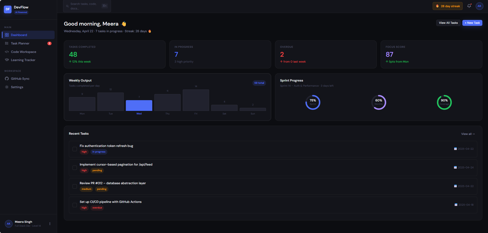
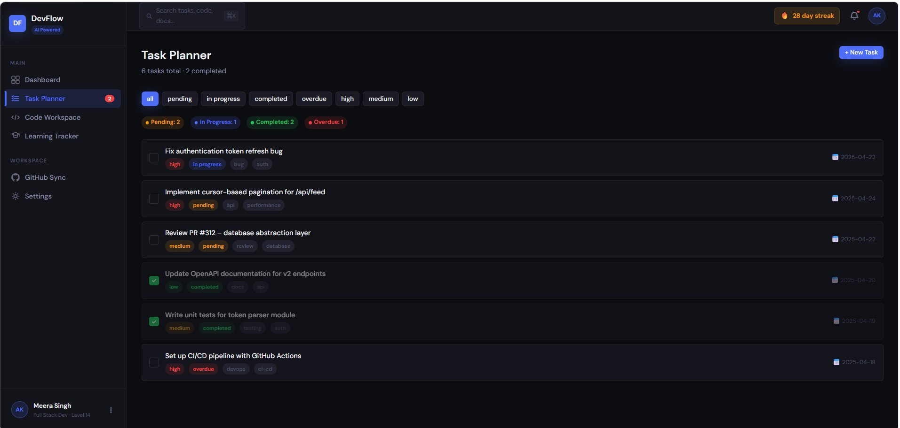
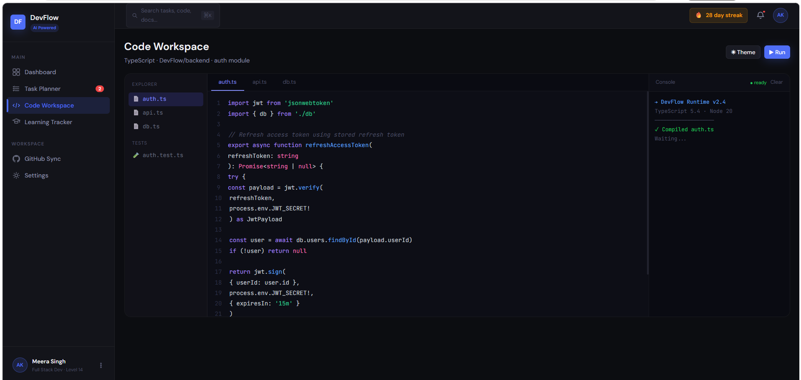
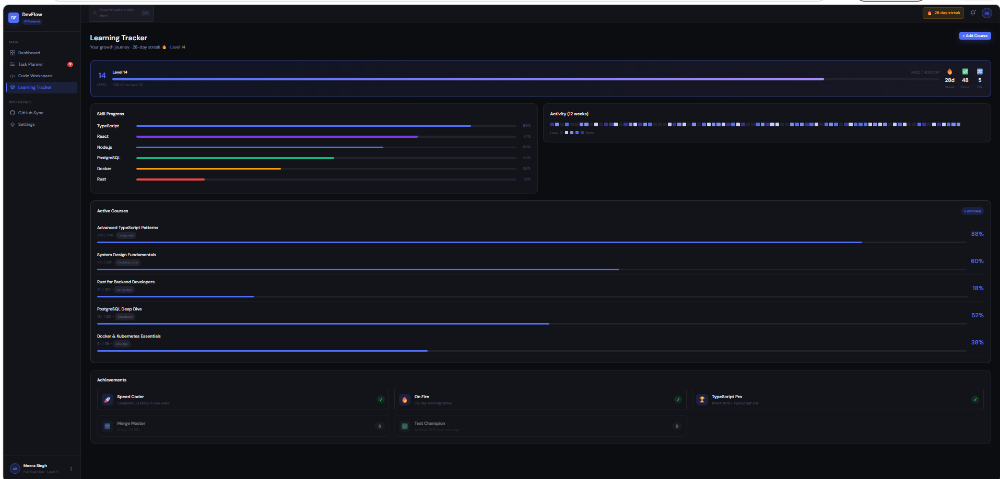

# 🚀 DevFlow – Developer Productivity Dashboard

This project started as an attempt to design a clean and practical developer dashboard that I would actually use myself.

Instead of focusing only on visuals, I tried to combine UI/UX design with a simple Python backend to simulate real-world behavior like task tracking and progress monitoring.

# 🚀 DevFlow – Developer Productivity Dashboard

🚀 **Live Demo:** https://69e7ddf1321ea500a0e7b093--serene-meerkat-b2cd01.netlify.app/

This project started as an attempt...
---

## 📸 Screenshots

### Dashboard



### Task Planner



### Code Workspace



### Learning Tracker



---

## ✨ Features

* Task management with priority and status tracking
* Learning progress tracker with levels and streak system
* Code workspace UI with editor and output panel
* Dashboard with productivity insights
* Simple backend APIs using Flask
* Works even without backend (fallback data)

---

## 🧠 Design Approach

The main focus of this project was usability and clarity.

Instead of adding too many features, I focused on:

* Keeping the interface clean and distraction-free
* Making navigation simple and intuitive
* Ensuring consistent spacing and layout

Some parts currently use mock data for faster UI rendering, but the backend structure is ready for real integration.

---

## 🐍 Backend (Python – Flask)

The backend is a lightweight Flask application that provides basic APIs:

* `/tasks` → fetch tasks
* `/add-task` → create task
* `/progress` → user progress
* `/dashboard-summary` → dashboard data

No database is used — data is stored in memory for simplicity.

---

## 💻 Frontend

* Built using HTML, CSS, and JavaScript
* Responsive layout using Flexbox/Grid
* Simple SPA navigation
* Clean dark theme UI

---

## 👤 User

```json
{
  "name": "Meera Singh",
  "level": 14,
  "streak": 28
}
```

---

## 🚀 How to Run

### Backend

```bash
cd DevFlow/backend
pip install -r requirements.txt
python app.py
```

### Frontend

Open:

```bash
frontend/index.html
```

Or run:

```bash
cd frontend
python -m http.server 8080
```

---

## 💭 Personal Note

I built this project to understand how modern productivity tools work and how UI/UX connects with backend systems.

The goal was to keep things simple, usable, and realistic rather than over-engineering features.

---

## 🔧 Future Improvements

* Add database integration
* Improve mobile responsiveness
* Connect fully with backend APIs
* Add authentication system

---

## 📌 Note

This project focuses more on UI/UX and system design rather than full production-level implementation.

---

## ❤️

Built for learning and experimentation.
